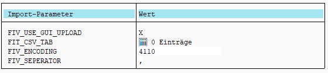
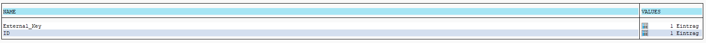

A simple function module which takes a CSV and converts it to a simple string-based table. CSV can be provided using GUI-Upload or directly via a string table. <br>

## Demo

Example CSV: <br>


Calling the function module: <br>


Result: <brt>



## Requirements
First create all required datatypes before running the function module.

1. Dataelement: `ZDT_STRING` internal type `String` <br>
2. Tabletype: `ZTT_STRING` line type `Z_DT_STRING`. <br>
3. Structure `ZST_CSV_SIMPLE` with components <br>
    a. `NAME` type `ZDT_STRING` <br>
    b. `VALUES` type `ZTT_STRING`<br>
4. Tabletype `ZTT_CSV_SIMPLE` line type `ZST_CSV_SIMPLE`


## Function module

```abap
FUNCTION z_csv_to_itab_simple.
*"----------------------------------------------------------------------
*"*"Lokale Schnittstelle:
*"  IMPORTING
*"     REFERENCE(FIV_USE_GUI_UPLOAD) TYPE  XFELD DEFAULT 'X'
*"     REFERENCE(FIT_CSV_TAB) TYPE  ZTT_STRING OPTIONAL
*"     REFERENCE(FIV_ENCODING) TYPE  ABAP_ENCODING DEFAULT '4110'
*"     REFERENCE(FIV_SEPERATOR) TYPE  CHAR1 DEFAULT ','
*"  EXPORTING
*"     REFERENCE(FET_TAB_SIMPLE) TYPE  ZTT_CSV_SIMPLE
*"----------------------------------------------------------------------

*&---------------------------------------------------------------------*
*& Check import vars
*&---------------------------------------------------------------------*
  IF fiv_use_gui_upload EQ abap_false AND fit_csv_tab IS INITIAL.
    MESSAGE 'Please use GUI-Upload or provide FIT_CSV_TAB.' TYPE 'E' DISPLAY LIKE 'E'.
    EXIT.
  ENDIF.

  IF fiv_use_gui_upload EQ abap_true.
    IF fit_csv_tab IS NOT INITIAL.
      MESSAGE 'Can not process FIT_CSV_TAB when GUI-Upload is selected.' TYPE 'E' DISPLAY LIKE 'E'.
      EXIT.
    ENDIF.
    IF fiv_encoding IS INITIAL.
      MESSAGE 'Please specify file encoding for GUI-Upload (or use default 4110).' TYPE 'E' DISPLAY LIKE 'E'.
      EXIT.
    ENDIF.
  ENDIF.

  IF fiv_seperator IS INITIAL.
    MESSAGE 'Please specify CSV seperator (or use default ,).' TYPE 'E' DISPLAY LIKE 'E'.
    EXIT.
  ENDIF.

*&---------------------------------------------------------------------*
*& Load CSV into STRING Tab
*&---------------------------------------------------------------------*
  DATA lt_csv_tab TYPE TABLE OF string.
  IF fiv_use_gui_upload EQ abap_false.
    lt_csv_tab = fit_csv_tab.
  ELSE.
    DATA lv_csv_path_in TYPE ibipparms-path.
    CALL FUNCTION 'F4_FILENAME'
      IMPORTING
        file_name = lv_csv_path_in.

    CALL METHOD cl_gui_frontend_services=>gui_upload
      EXPORTING
        filename = |{ lv_csv_path_in }|
        codepage = fiv_encoding
      CHANGING
        data_tab = lt_csv_tab
      EXCEPTIONS
        OTHERS   = 1.

    IF sy-subrc NE 0.
      MESSAGE 'Error while uploading CSV.' TYPE 'E' DISPLAY LIKE 'E'.
      EXIT.
    ENDIF.
  ENDIF.

*&---------------------------------------------------------------------*
*& Process CSV
*&---------------------------------------------------------------------*
  DATA lt_result_tab LIKE FET_TAB_SIMPLE.
  DATA ls_result_tab LIKE LINE OF lt_result_tab.

  DATA lv_csv_header_line TYPE string.
  READ TABLE lt_csv_tab INTO lv_csv_header_line INDEX 1.
  DELETE lt_csv_tab INDEX 1.

  DATA lt_csv_header_fields TYPE TABLE OF string.
  SPLIT lv_csv_header_line AT fiv_seperator INTO TABLE lt_csv_header_fields.
  IF lv_csv_header_line IS INITIAL.
    MESSAGE |Error while parsing csv header.| TYPE 'E' DISPLAY LIKE 'E'.
    RETURN.
  ENDIF.

  DATA lv_header_field TYPE string.
  LOOP AT lt_csv_header_fields INTO lv_header_field.
    CLEAR: ls_result_tab.
    ls_result_tab-name = lv_header_field.
    APPEND ls_result_tab TO lt_result_tab.
  ENDLOOP.

  "Process Body
  DATA lv_csv_body_line TYPE string.
  DATA lt_csv_body_fields TYPE TABLE OF string.
  DATA lv_body_field TYPE string.
  FIELD-SYMBOLS <fs_table_entry> LIKE LINE OF lt_result_tab.
  LOOP AT lt_csv_tab INTO lv_csv_body_line.
    SPLIT lv_csv_body_line AT fiv_seperator INTO TABLE lt_csv_body_fields.
    LOOP AT lt_csv_body_fields INTO lv_body_field.
      READ TABLE lt_result_tab ASSIGNING <fs_table_entry> INDEX sy-tabix.
      IF sy-subrc EQ 0 AND <fs_table_entry> IS ASSIGNED.
        APPEND lv_body_field TO <fs_table_entry>-values.
      ENDIF.
    ENDLOOP.
  ENDLOOP.

  fet_tab_simple = lt_result_tab.
ENDFUNCTION.
```

---
© unpacked - [licence](../../LICENSE)